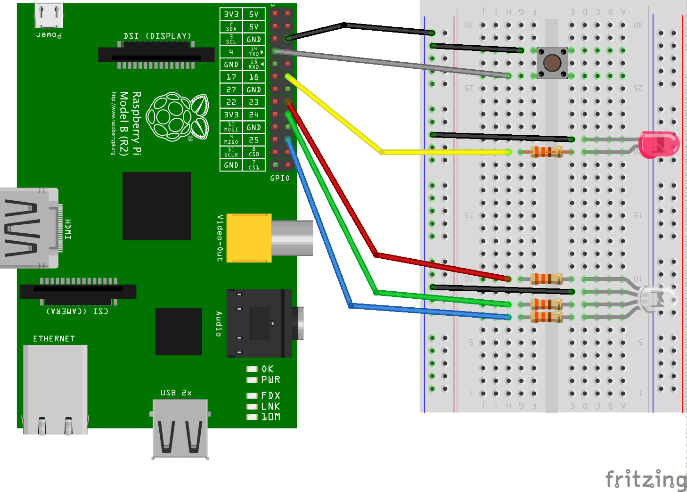
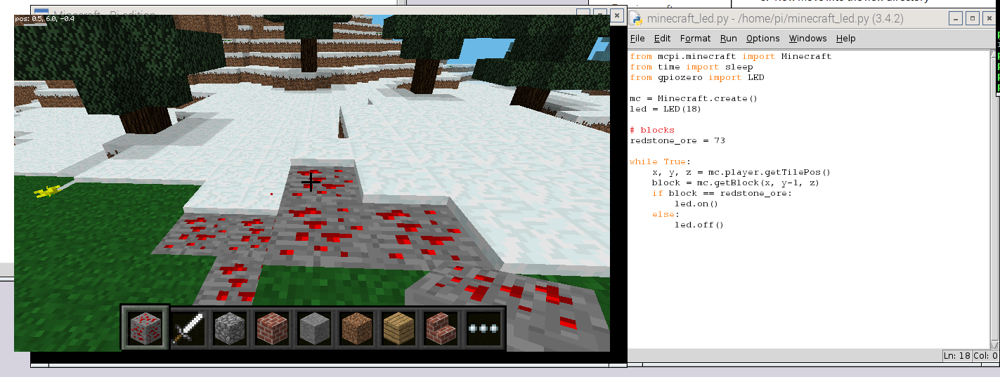

    
# Banbridge Dojo #
# Minecraft: Lights and Sensors

## Introduction

In the following exercises we are going to look at connecting our computer to simple circuits with LEDs and sensors and then using our programs to react to events and control things. These programs will be built in `Python`. Finally we'll dig into how we can interact with both `Minecraft` and our circuits.

## Resources

You will need the following:

1. Raspberry Pi (any model) running Raspbian Jessie
1. Breadboard
1. Pi leaf pin label
1. 330 Ohm resistor X 4
1. A LED
1. A RGB LED
1. Push Button Switch
1. Male-Female & Male-Male jump leads

<div class="page-break" />

**Safety & Warnings:**
`We are going to be using electricity and poking about with wires.  The Pi is at greater risk than you are ... if you plug things onto the wrong pins, or touch other parts of the pi with wires you can **kill the Pi**.  Also some of the components e.g. LED's will be destroyed if too much current flows through them ... please follow the diagrams carefully until you know what you are doing :-)`

## A Look at Raspberry Pi's GPIO

A Rapsberry Pi has a set of metal pins or holes (in the case of the Pi Zero) sticking out of the board at the top left of the picture. The pins can be used to send signals to and from the computer. Many of they can be used for almost anything and what's amazing is that they can controlled by your programmes. Because they can be used for any purpose, they are called General Purpose Input Output pins, or GPIO for short.

If your Pi does not contain labels for the pins, then the fantastic [Pi Leaf](https://www.raspberrypi.org/blog/raspberry-leaf/) is an easy and **free** aid to help you for this purpose.

<div class="page-break" />

## Circuit



### Exercise 1

**Can you:**

1. Shutdown the Pi
1. Build the circuit shown previously by connecting (this contains a number of steps so take your time to reduce chance of mistakes :D):
    1. One of the GND pins to the **-/negative** rail on the breadboard
    1. **GPIO pin 4** to the **push button switch** (it doesn't matter which side) and the other leg of the pin to the **-/negative** rail on the breadboard.
    1. **GPIO pin 18** to the 330 ohm resistor which is connected to the positive leg of the **LED**. The positive leg is the longer one (the negative leg is also the one on the same side as the flat end of the LED) and the negative leg back to the **-/negative** rail on the breadboard.
    1. **GPIO pins 23, 24 & 25** connected to the 330 ohm resistors connected to the **R, G, & B** legs of the **RGB LED**. The **earth** leg of the LED is the longest leg and it should be connected to the **-/negative** rail on the breadboard. The **R** leg is the one to left of the longest leg, then the **G & B** are the two on the other side.
1. Turn on the Pi

## Let's get started with Python

**Python** is a perfect language to dive into programming. Python has a gentle learning curve yet is also used by professional software developers. You don't need to know all the complexities of algorithms and syntax, you just want to write basic programs to automate mundane computer tasks.

For this worksheet, Python is perfect as it have modules (a bunch of code that contains useful functions we can use in our own program) that have been built that allow us interact with both Minecraft and GPIO. We'll take a look at them some more as we dive into the exercises.

### Exercise 2

1. Start a Python 3 editor. You can do this by either clicking on `Menu > Programming > Python 3 (IDLE)` or by opening a terminal and typing
  ```sh
  idle3 &
  ```
1. When the Python shell window opens up, click `File > New Window` to open a new window. This is where you'll enter your code.
1. Save the file as `blinking_led.py`
1. Enter the following code
  ```python
  from gpiozero import LED
  from time import sleep

  led = LED(18)

  while True:
      led.on()
      sleep(1)
      led.off()
      sleep(1)
  ```
1. Save with `Ctrl + S` and run with `F5`.

### Challenge:

1. What happens when you run the code?
1. Make the light stays on longer than it goes off?
1. Replace the code to turn the light on and off with the `led.toggle()` remembering you still need to `sleep(1)` to ensure the lights stays on or off for one second.
1. Replace the entire `while` loop with `led.blink()`
1. `Advanced:` Try to modify the behavior of `led.blink()` using various arguments as documented [here](http://pythonhosted.org/gpiozero/outputs/#led).

### How does it work?

1. To interact with the GPIO pins we'll use the `gpiozero` library and the `LED` class which is used to interact with the pin as an LED.
1. We set pin 18 to operate as a LED with `led = LED(18)`.
1. in the loop we alternate between setting the LED on using `led.on()` and then waiting for one second before turning the LED off with `led.off()`

<div class="page-break" />

## Controlling an LED from Minecraft

Using `gpiozero` along with the `mc` Minecraft Python API allows us to add some pretty cool interactions between our LED and the world within Minecraft.

The following exercise shows us how to control the LED by standing on a block of Redstone Ore. Get coding :D



### Exercise 3

**Can you:**

1. In the Python shell, click `File > New Window` to open a new window.
1. Save the file as `minecraft_led.py`
1. Enter the following code:
  ```python
  from mcpi.minecraft import Minecraft
  from gpiozero import LED

  # Initialize minecraft and our LED pin
  mc = Minecraft.create()
  led = LED(18)

  # blocks
  redstone_ore = 73

  while True:
      x, y, z = mc.player.getTilePos()
      block = mc.getBlock(x, y-1, z)
      if block == redstone_ore:
          led.on()
      else:
          led.off()
  ```
1. Save with `Ctrl + S` and run with `F5`.

### Challenge:

1. What happens when you run the code? Remember to add some redstone ore blockss so you can stand on them (unless your world already has some just lying around :D)
1. Change the code to turn the light on and off with the `led.toggle()`. Is it any better than the previous code? Think about whether any lines of code were reduce or whether it makes the code more understandable?
1. Read about the [Minecraft API](http://www.stuffaboutcode.com/p/minecraft-api-reference.html) and change the block type from Redstone Ore to something else. Remember to save and run your code again after any updates!

### How does it work?

1. We'll interact with the Minecraft API using `mcpi.minecraft` and the `Minecraft`
 class.
1. As before we're interacting with GPIO using the `gpiozero` library and the `LED` class.
1. We initialize the minecraft library's connection to the game using `mc = Minecraft.create()`
1. We set pin 18 to operate as a LED with `led = LED(18)`.
1. We set a variable to hold the type of block which we will need to find to turn on the LED. Each type of block in minecraft is represented by a different number. For example air is 0, grass is 2, snow is 78. in this case we define `redstone_one = 73` as redstone ore is represented by 73.
1. in the loop we fetch the players current position using `mc.player.getTilePos()`. This is returned as a set of co-ordinates and is mapped to x, y, and z
1. y represents vertical position of the player so we use y-1 to find the block one place beneath the player. The type of block is returned from `mc.getBlock`
1. Finally we check if that block is redstone ore. If it is then turn the `led.on()`. Otherwise, turn the `led.off()`

## Let's add a switch

So far we've looked at using software to control the physical world. Let's look at how we can use a switch to modify behavior within the minecraft world.

### Exercise 4

**Can you:**

1. In the Python shell, click `File > New Window` to open a new window.
1. Save the file as `minecraft_teleport.py`
1. Enter the code shown below.
1. Save with `Ctrl + S` and run with `F5`.
  ```python
  from mcpi.minecraft import Minecraft
  from time import sleep
  from gpiozero import LED, Button

  mc = Minecraft.create()
  led = LED(18)
  button = Button(4)
  start = mc.player.getTilePos()

  while True:
      sleep(0.1)
      if button.is_pressed:
          led.on()
          mc.postToChat("Teleport activated!")
          sleep(1)
          mc.player.setPos(start.x, start.y, start.z)
          led.off()
  ```

### Challenge:

1. What happens when you run the code and press the button?
1. Change the code to turn the light on and off with the `led.toggle()`. Is it any better than the previous code? Think about whether any lines of code were reduce or whether it makes the code more understandable?
1. `Advanced:` Can you add any other cool effects when the button is pressed. How about changing the type of blocks that surround the player so it appears like a transporter beam?
1. `Advanced:` Can you make the player jump instead of teleporting?

### How does it work?

Lets look at some elements we've not encountered before:

1. As before we're interacting with GPIO using the `gpiozero` library and this time we're also interacting with the `Button` class.
1. We set pin 4 to operate as a button with `button = Button(4)`.
1. We set a variable `start` to hold the  position that the player started in using `mc.player.getTilePos()`.
1. in the loop we check if the button has been pressed using `button.is_pressed`. If it is then we turn on the LED but also post a message to the game to indicate teleport has started using `mc.postToChat("Teleport activated")`. We then teleport the player back to their starting position using `mc.player.setPos` and turn off the LED.

<div class="page-break" />

## Let's add a bit of colour

We've looked at simple LEDs and switches, but now we're going to look at controlling the colour of our RGB LED. A single LED die can only emit monochromatic light which could be one of the three primary colors - red, green and blue, known as RGB. A RGB LED allows us to change the colour emitted by the LED by changing the power of the Red, Green and Blue diodes. In this exercise, we're going to change the colour based on what block we're standing on in Minecraft.

### Exercise 5

**Can you:**

1. In the Python shell, click `File > New Window` to open a new window.
1. Save the file as `minecraft_block_lights.py`
1. Enter the code shown below.
1. Save with `Ctrl + S` and run with `F5`.
  ```python
  from mcpi.minecraft import Minecraft
  from time import sleep
  from gpiozero import RGBLED

  mc = Minecraft.create()
  rgbled = RGBLED(23,24,25)

  # block
  grass = 2
  ice = 9
  sand = 12

  # colours
  green = (0, 1, 0)
  blue = (0.1, 0.1, 0.1)
  yellow = (1, 1, 0)

  # block: colour
  colours = {
      grass: green,
      ice: blue,
      sand: yellow,
      }

  while True:
      sleep(0.1)
      p = mc.player.getTilePos()
      block = mc.getBlock(p.x, p.y-1, p.z)
      if block in colours:
          colour = colours[block]
          rgbled.color = colour
      else:
          rgbled.off()
  ```

### Challenge:

1. What happens when you run the code and move around in Minecraft?
1. Can you add more block types and colours to the program?

### How does it work?

Lets look at some elements we've not encountered before:

1. As before we're interacting with GPIO using the `gpiozero` library and this time we're also interacting with the `RGBLED` class.
1. We set pins 23, 24 & 25 to control the Red, Green and Blue powers levels in the RGB LED using `rgbled = RGBLED(23,24,25)`.
1. As in exercise 3, we define variables for `grass, ice and sand`
1. Below that, add the colours that represent these block types. These colours are made up of `tuples`. A tuple is a data type (like an integer, string, or list) used to store a number of items in a particular order. These could be the x, y and z coordinates or, as in this case, the R, G and B values of a colour. These are 3-tuples because they each contain 3 values. Each value is a float between 0 & 1 and indicate how much power is used for that value.
1. Next, below the colours, create a dictionary mapping each of the block types to a particular colour. A dictionary is a data type used for storing relations between two objects, like an address book mapping a name to a telephone number. The items in the dictionary are referred to as key-value pairs, so in an address book the name is the "key" and the phone number is the "value". In our case the block type is the "key" and the colour is the "value".
1. In the `while` loop, we find out the type of block the player is standing on and check if the block is in the dictionary. If it is, then we access the colour and finally set the colour on the LED using `rgbled.color = colour`.
1. If the block is not in the dictionary then we turn the led off using `rgbled.off()`
