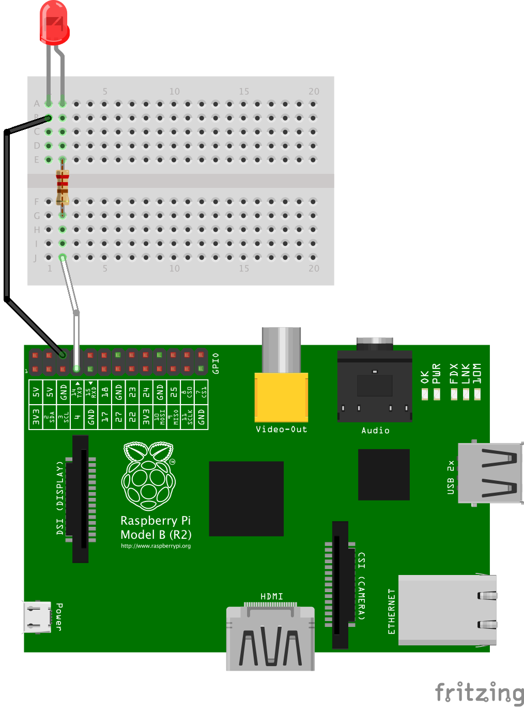
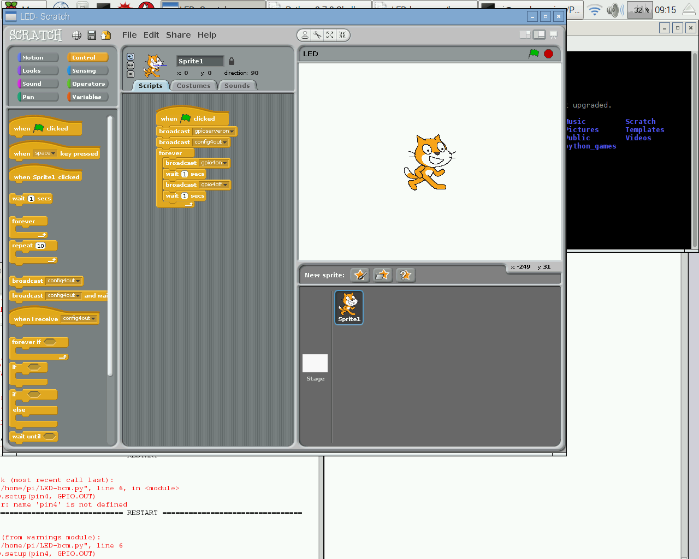
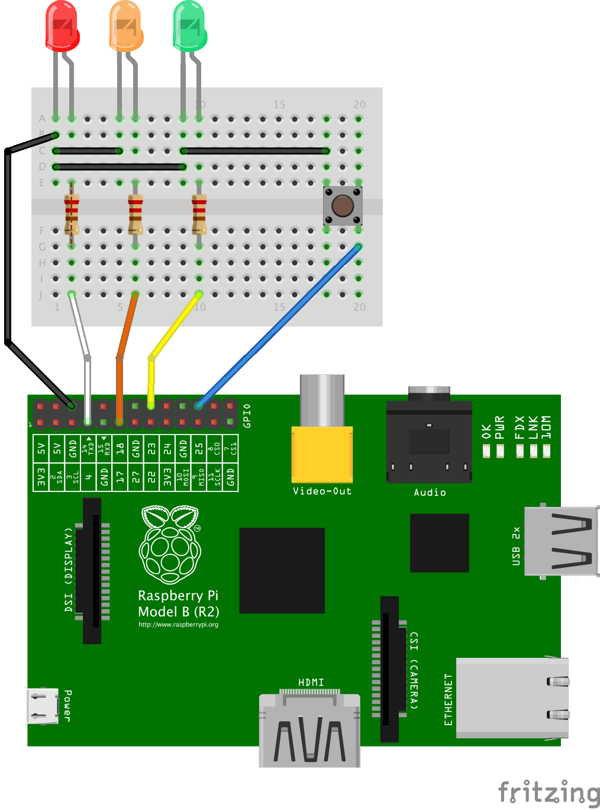
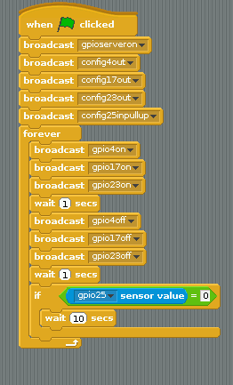

  
# Banbridge Dojo#

# Physical Computing: #
## Connecting a computer to the real world ##

**Resources:** Raspberry Pi (any model),  SD card with Raspbian Jessie, breadboard, Pi leaf pin label, 220 Ohm resistors, Variety of Colours of LED, Variety of coloured link wires with socket to connect to GPIO pin.

**Safety & Warnings:**
We are going to be using electricity and poking about with wires.  The Pi is at greater risk than you are ... if you plug things onto the wrong pins, or touch other parts of the pi with wires you can **kill the Pi**.  Also some of the components e.g. LED's will be destroyed if too much current flows through them ... please follow the diagrams carefully until you know what you are doing :-)

### Introduction ###
In this series we are going to look at connecting our computer to stuff and then using our programs to react to events and control things.


1. The Electrical Circuit
1. Lights and switches
2. Lets look at a Raspberry Pi
1. Scratch meets the real world
1. Letting Python out of its cage


Appendices & Data Sheets
1. Raspberry Pi pin numbering
1. LEDs current calculation
1. Resistor Colour Codes
1. Pi Leaf


<div class="page-break" />

### The Electrical Circuit ###
We are going to make a little **light** turn on and off by pressing a **switch**.

We need to use a power source (a **battery**) to push an electrical current down some wire and through the bulb and back to the battery.  This current flowing around a loop or **circuit** will make the bulb light up.

A switch is just a handy way to break the circuit and so stop the flow of electricity.

Electricity only flows through **conductors** like wire, tin foil, water, nails ... It won't flow through insulators like plastic, wood, clay ...

Lets use a battery, a switch, some wire and a bulb to make a torch.  You have some wire with "crocodile clips" to make the circuit.


There are a few things in your tray can you use your torch circuit to test all the things ... which ones are conductors? which ones are insulators?

#### Introducing the Breadboard ####
Crocodile clips are a bit big and clumsy.  The breadboard is much neater, especially when you are using small lights like LED's.

Lets use the torch circuit to test the breadboard.  There are lots of wires joining holes together in the breadboard.  Can you use your torch circuit to find the pattern ... which holes are connected?


<div class="page-break" />

### Lights and switches ###
Lets make a new torch circuit using a press switch and LED.


LED stands for light-emitting diode, which means that much like their diode cousins, they’re polarized. There are a handful of identifiers for finding the positive and negative pins on an LED. You can try to find the longer leg, which should indicate the positive, anode pin.

Or, if someone’s trimmed the legs, try finding the flat edge on the LED’s outer casing. The pin nearest the flat edge will be the negative, cathode pin.


<div class="page-break" />

### Look at a Raspberry Pi ###


      

Here you can see three versions of the Raspberry Pi.  Each one has a set of metal pins sticking out of the board at the top left of the picture.


The pins are used to send signals to and from the computer.  Many of they can be used for almost anything and controlled by your programmes. So they are called General Purpose Input Output pins, or GPIO for short.


On your Pi there should already be a piece of paper labeling the pins.


Each pin can turn on or off,or go HIGH or LOW in computing terms. When the pin is HIGH it outputs 3.3 volts (3v3); when the pin is LOW it is off.


<div class="page-break" />

### Scratch Meets the Real World. ###





**Exercises**
Can you:
1) Shutdown the Pi
1) Build the circuit shown above connecting the GPIO pins 4,17,23 to the LEDs as shown.
1) Turn on the Pi and start a Python 2 editor
2) Type in the code shown below in a python or text editor
1) What happens when you run the code?
1) The light stays on longer than it goes off?

<div class="page-break" />

### Traffic Lights ###





**Exercises**
Can you
1) Shutdown the Pi
1) Build the circuit shown above connecting the GPIO pins 4,17,23 to the LEDs as shown.
1) Turn on the Pi and start Scratch
2) Enter the program shown above
1) What happens when you run the code?
1) Can you change the code so that the lights go through the traffic light sequence?
2) Can you change the code so that pressing the button makes the lights pause for 5 seconds?   


<div class="page-break" />

### Letting the Python out of its computer ###

Type in the following block of code. What do you think will happen when you run it?

Try it and see.


**Single LED Flashing**
```python
import RPi.GPIO as GPIO
import time

pin4 =4
GPIO.setmode(GPIO.BCM)
GPIO.setup(pin4, GPIO.OUT)
while True:
    GPIO.output(pin4, GPIO.HIGH)
    time.sleep(1)
    GPIO.output(pin4, GPIO.LOW)
    time.sleep(1)

GPIO.cleanup()
```

**Exercises**
Can you:
1) Shutdown the Pi
1) Build the circuit shown above connecting the GPIO pins 4,17,23 to the LEDs as shown.
1) Turn on the Pi and start a Python 2 editor
2) Type in the code shown below in a python or text editor
1) What happens when you run the code?
1) The light stays on longer than it goes off?


<div class="page-break" />

**3 LED Flashing**

  

**Exercises** Can you:
1) Shutdown the Pi
1) Build the circuit shown above connecting the GPIO pins 4,17,23 to the LEDs as shown.
1) Turn on the Pi and start a Python 2 editor
2) Type in the code shown below in a python or text editor
1) What happens when you run the code?
1) Can you change the code so that the lights go through the traffic light sequence?
2) Can you change the code so that pressing the button makes the lights pause for 5 seconds?   

 ```python
import RPi.GPIO as GPIO
import time

pin4 =4
pin17 =17
pin23 =23
pin25 =25
GPIO.setmode(GPIO.BCM)
GPIO.setup(pin4, GPIO.OUT)
GPIO.setup(pin17, GPIO.OUT)
GPIO.setup(pin23, GPIO.OUT)
GPIO.setup(pin25, GPIO.IN, pull_up_down=GPIO.PUD_UP)
GPIO.add_event_detect(pin25, GPIO.RISING, callback=pressed_callback, bouncetime=200)  # add rising edge detection on a channel

while True:
    GPIO.output(pin4, GPIO.HIGH)
    GPIO.output(pin17, GPIO.HIGH)
    GPIO.output(pin23, GPIO.HIGH)
    time.sleep(1)
    GPIO.output(pin4, GPIO.LOW)
    GPIO.output(pin17, GPIO.LOW)
    GPIO.output(pin23, GPIO.LOW)
    time.sleep(1)

def pressed_callback(channel):
    print('A button has been pressed!')
    print('Edge on channel %s'%channel)

GPIO.cleanup()
```      
